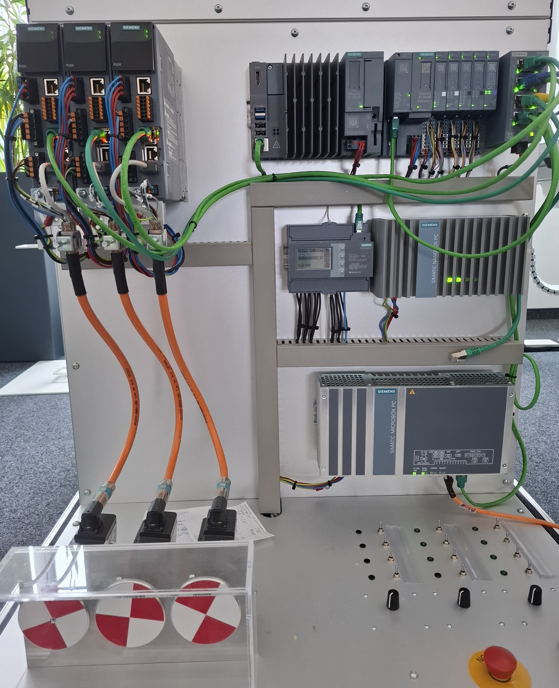

# Office Hardware Demo Case

## Description

This project serves as an very simple application example, providing a demo case for experimenting with hardware configuration setups and basic I/O controls. It also showcases the hardware usage of SINAMICS drives via a GSDML file and motion control through a contributed SINAMICS drive function library. Feel free to adapt and enhance this project to suit your specific requirements.

## Represented SIMATIC AX Features

1.  Hardware configuration with support packages (PLC)
2.  Hardware configuration with GSD files (peripherals)
3.  I/O signal mapping
4.  Software programming with preprocessor directives
5.  OPC UA exposed variables for potential HMI use cases
6.  Commissioning capabilities (including scripts)
7.  Diagnostics capabilities (including scripts)

## Hardware

This section briefly describes the setup of the rack and its corresponding hardware components.

The following image illustrates the setup, followed by a description of its components.



**Components on the left side of the case:**
*   3x SINAMICS S200 drives (V6.4)

**Components on the right side of the case:**
*   1x ET200SP IM155-6 PN HF 4.2
    *   DI 8x 24V DC HF
    *   DI 8x 24V DC HS
    *   DQ 8x 24V DC 0.5A
    *   DQ 8x 24V DC 0.5A
    *   AI 4xI 2-/4-wire ST
*   1x IPC-427E (Industrial Edge Device)
    *   IED App: **vPLC 1517 V4.0**

## Usage

### Create a New Project Using the "Project Template"

This application example repository can be cloned using Git. Additionally, a project template package is available for rapid AX project creation utilizing `apax`.

> To use this application example, you need to log in to the GitHub registry. You'll find more information [here](https://github.com/simatic-ax/.github/blob/main/docs/personalaccesstoken.md).

0.  Log in to SIMATIC AX
    ```sh
    apax login
    ```
1.  Navigate to the desrired folder.
2.  Create a new project and open it in AX Code.

    Run the following commands in a CLI:

    ```sh
    apax create @simatic-ax/ae-demo-rack --registry https://npm.pkg.github.com ae-demo-rack
    ```

    ```sh
    cd ae-demo-rack
    ```
    *Optional*: Open it in AX Code.

    ```sh
    axcode .
    ```
3.  Install the dependencies:

    ```sh
    apax install
    ```
    > You may also need to log in to the GitHub package registry using your GitHub credentials to install community content referenced in this project. Use `apax login` again for this purpose.

## How-To

Please refer to the additional documentation [here](docs/HowTo.md) to learn how to set up the demo case and operate the I/O board.

## Contribution

Thank you for your interest in contributing! Feel free to report bugs, suggest improvements, clarify documentation, and highlight any other issues regarding this repository in the "Issues" section. Even better, you are welcome to propose changes to this repository using "Merge Requests." The designated CODEOWNERS will review and address them.

Happy coding!

🐱‍💻 BEEP, BOOP, BEEP, BEEP, BOOP 🐱‍🏍